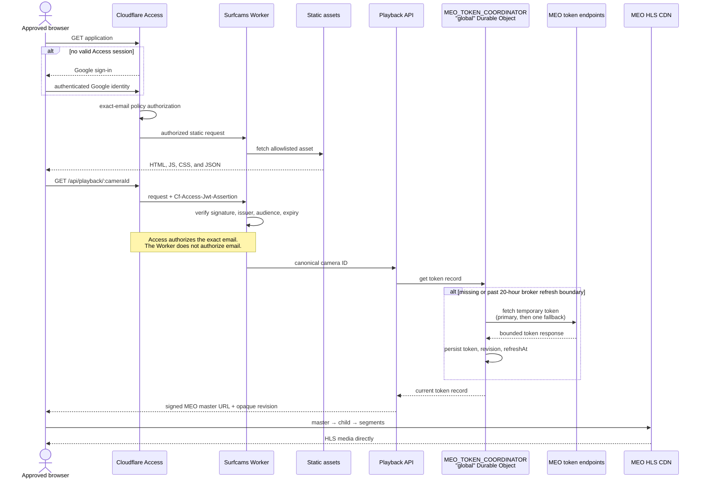
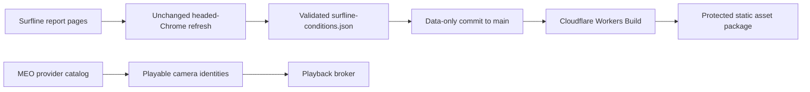

# Architecture

Surfcams Portugal is a vanilla browser application packaged with a small
Cloudflare Worker backend. Cloudflare Access protects the complete production
hostname. The Worker serves an explicit set of static assets and brokers a
temporary MEO playlist signature; MEO still serves every manifest and segment
directly to the browser.

The approved design is
[Private Surfcams MEO Playback Migration Design](superpowers/specs/2026-08-19-private-meo-worker-migration-design.md).

## Request Sequence

Cloudflare Access is the exact-email authorization layer. The playback API's
independent JWT validation is defense in depth: it verifies the assertion's
signature, issuer, audience, and expiry, but does not inspect an email claim to
make an authorization decision.

## Runtime

- `index.html` defines the page shell and embeds the current camera database in `#embeddedCameraDb`.
- `src/main.js` owns the UI controller for map markers, filters, list rows, details, and events.
- `src/camera-data.js` loads the embedded provider-native MEO DB first and falls back to `data/beachcam-cameras.json`; local stream overrides are intentionally unsupported.
- `src/spot-data.js` loads optional normalized Surfline, MEO, mapping, coast exposure, spot metadata enrichment, and Lisbon drive estimate JSON files.
- `src/explore-catalog.js` combines playable MEO cameras with media-free promoted/guide Surfline subjects for Explore. Informational subjects can resolve to a clearly named linked MEO feed, but never become camera or favorite identities themselves.
- `src/favorites.js` owns default favorites and browser persistence.
- `src/surf-rating.js` maps camera conditions into Surfline-style model labels, applies spot-level shelter/exposure mechanics where known, and exposes wind, swell, and coast-exposure vectors for the UI. With resolved conditions it checks the min–max surf range and hard-vetoes on Surfline `POOR`/`VERY_POOR`.
- `src/forecast-sources.js` resolves each spot's conditions with provenance: current Surfline conditions (promoted spots and trusted cam matches, at most 6h old) beat an on-load Open-Meteo result (<2h), which beats the static embedded MEO snapshot. The UI shows the winning source as a chip. `Might be good` requires that current Surfline snapshot as a local-face anchor; it never promotes static MEO-only conditions.
- `src/live-forecast.js` fetches Open-Meteo marine+wind for a spot when its detail panel opens with only static data, cached in `localStorage` for an hour.
- `src/stretch-view.js` + `data/stretches.json` make the Caparica strip and Linha seafront scannable as units using clearly named MEO cameras plus Surfline wave information.
- `src/monitor-cameras.js` limits "might be good" suggestions to the Nazaré→Sesimbra west-coast fence and to spots with fresh (non-static) provenance.
- Promoted Surfline spots (`data/promoted-spots.json`, built from the hand-curated `data/surfline-promotions.json` manifest) remain informational Explore/advice subjects. They may link to a trusted MEO camera or stretch but never enter the playable/favoritable camera roster.
- `src/playback-client.js` obtains signed MEO URLs from the same-origin API and keeps them in memory only.
- `src/video-player.js` owns generation-safe HLS playback, lazy-loads hls.js only when the browser needs it, and performs at most one forced broker refresh after the first fatal media error in a player generation.
- `src/styles/app.css` contains the app layout and visual system.
- `worker/router.js` sends authenticated `/api/*` requests through the JWT verifier and playback API, while other paths use the static `ASSETS` binding.
- `worker/playback-catalog.js` derives the immutable provider-native playable MEO roster. The API accepts a camera ID, never a caller-provided URL.
- `worker/meo-token-coordinator.js` exposes one SQLite-backed Durable Object. All Worker locations reach the fixed-name `global` instance through `MEO_TOKEN_COORDINATOR`, so one stored revision and one in-flight refresh govern the provider token.
- `worker/bootstrap.js` is a separate content-free deployment that returns bounded 503 JSON before Access is configured.
- `scripts/build-runtime-assets.js` copies only the reviewed runtime allowlist into ignored `dist/`; tests, caches, documentation, repository metadata, and secrets do not ship.

The broker refreshes its stored token after no more than 20 hours. MEO's
observed token value can remain usable for up to 24 hours, so the refresh
boundary is not a revocation boundary. API responses use `private, no-store`,
and the Worker never proxies or rewrites MEO manifests or segments.

## Surfline Intelligence Boundary

Surfline supplies conditions, forecasts, ratings, advice, and informational
Explore subjects. It never supplies a camera identity, HLS URL, or still image.
The Surfline refresh workflow remains the existing three-times-daily plus
manual headed-Chrome/CDP job. Its accepted commit is ordinary `main` data, so a
successful Workers Build deploys it with the rest of the protected asset
package.

## Data Pipeline

- `scripts/crawl-beachcam.cjs` crawls public Beachcam/MEO livecam pages into an explicit staging path; `scripts/validate-meo-crawl.cjs` binds names and IDs to provider feeds and refuses partial or unexpected refreshes before acceptance.
- `scripts/build-spot-data.js` normalizes the Beachcam/MEO camera index into `data/meo-spots.json`; preserve mode rekeys trusted OSRM routes across known camera-ID corrections and uses deterministic estimates only for new/changed rows.
- `scripts/cache-surfline-pages.js` builds Surfline mapping-review artifacts from cached HTML and can direct-fetch pages when Surfline allows it; it does not synthesize placeholder HTML when direct fetches are blocked.
- `scripts/cache-surfline-browser-cdp.js` fetches real Surfline HTML through a Chrome DevTools Protocol session after Chrome has passed Surfline's browser challenge.
- `scripts/build-surfline-spots.js` rebuilds `data/surfline-spots.json` from cached Surfline HTML, including primary report pages and embedded nearby spot records within 100km of central Lisbon.
- `scripts/build-meo-surfline-matches.js` remaps cached Surfline spots onto MEO camera rows, preserving curated mappings first and marking coordinate-only generated joins for review.
- `scripts/build-coast-exposures.js` aggressively extracts coast-facing bearings into `data/coast-exposures.json` from normalized Surfline metadata, MEO description cues, existing rating fallbacks, and regional heuristics.
- `scripts/build-spot-metadata-enrichment.js` writes `data/spot-metadata-enrichment.json`, a compact MEO-keyed layer of Surfline surf mechanics, source spot evidence, and coast exposure metadata for runtime enrichment.
- `scripts/build-surfline-needs-review-html.js` writes `docs/surfline-needs-review.html`, a local feedback interface for coordinate-only mappings that are excluded from runtime until curated; `scripts/apply-mapping-feedback.js` imports its exported decisions (accept → curated, reject → rejected, both preserved across regeneration).
- `scripts/extract-surfline-conditions.js` writes the volatile `data/surfline-conditions.json` from cached pages (feet/knots/°F normalized to metric; primary records preferred, fresh nearby records override primaries staler than 6h).
- `scripts/build-promoted-spots.js` applies the trusted MEO-camera/stretch gate to `data/surfline-promotions.json` and writes media-free informational records to `data/promoted-spots.json`.
- `scripts/build-promotion-map-html.js` writes `docs/surfline-promotion-map.html`, the persistent map for re-curating which Surfline spots are promoted.
- `scripts/refresh-surfline-conditions.js` is the polite conditions refresh: greedy set-cover picks ~3 pages that cover all promoted/favorite/stretch spots, fetches via Chrome CDP, and swaps `data/surfline-conditions.json` in only after an 80% freshness floor passes. `.github/workflows/update-surfline-conditions.yml` runs at 05:17, 11:17, and 17:17 UTC plus manual dispatch; `scripts/refresh-surfline-daily.sh` remains the local headed-Chrome fallback, and `scripts/check-conditions-freshness.js` is the staleness guard.
- `scripts/embed-camera-db.js` embeds that JSON into `index.html` so the default app load does not depend on a separate JSON fetch.
- `data/surfline-spots.json` stores normalized Surfline spots within 100km of central Lisbon, provider report URLs, coordinates, stable spot metadata, and provider snapshots. Volatile accepted readings live in `data/surfline-conditions.json` and are refreshed by the scheduled pipeline.
- `data/meo-surfline-matches.json` maps one MEO camera to one or more nearby Surfline reports using curated joins plus generated nearest-neighbor evidence that still needs user calibration.
- `data/coast-exposures.json` is intentionally hand-curatable: each entry keeps the chosen bearing, confidence, source, and evidence used by the extractor.
- `data/spot-metadata-enrichment.json` is the MEO-keyed Surfline metadata enrichment layer consumed by `src/spot-data.js`.
- Surfline report URLs, conditions, advice, and surf mechanics are retained; Surfline HLS, camera stills, camera aliases, and media schemas are excluded from production assets.
- `docs/surfline-meo-metadata-comparison.md` records the current source-quality comparison and source-precedence decision.
- `.cache/beachcam/` stores crawl responses locally and is not committed.
- `.cache/surfline/pages/` stores cached Surfline HTML and per-page provenance metadata locally and is not committed.

## Deployment

The functional Worker is configured in `wrangler.jsonc` with the `ASSETS`
binding, `MEO_TOKEN_COORDINATOR`, and the two required Worker secrets
`ACCESS_TEAM_DOMAIN` and `ACCESS_AUD`. The Google OAuth client secret exists
only in Cloudflare Access. Production builds run `npm run verify` before
`npm run deploy`; branch previews are disabled, and Cloudflare does not
generate Preview URLs for Workers that implement a Durable Object.

The initial `workers.dev` origin starts with fresh default favorites and surf
preferences because it cannot read the legacy GitHub Pages origin's
`localStorage`. GitHub Pages is retained only as a frozen pre-migration fallback
during protected acceptance and is disabled after Workers Builds, bot-commit,
and rollback validation. See the
[Access runbook](runbooks/cloudflare-access.md) and
[release runbook](runbooks/cloudflare-release.md).
