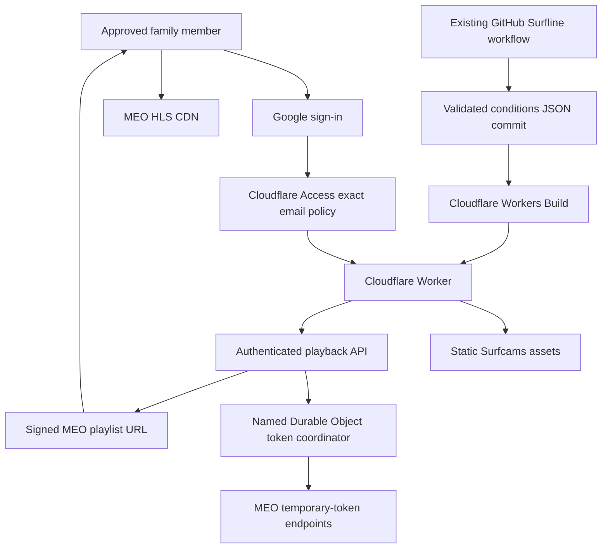

# Private Surfcams MEO Playback Migration Design

**Date:** 2026-08-19

**Status:** Approved for implementation

**Repository:** `kuangc/surfcams-portugal`

**Target branch:** `codex/meo-only-cameras`

## Summary

Move Surfcams Portugal from public, browser-only GitHub Pages delivery to a
Google-authenticated Cloudflare Worker. The Worker will serve the existing
application as static assets and provide a small authenticated playback API
that obtains MEO's temporary video token on the server. Authorized browsers
will continue loading HLS media directly from MEO.

The migration retains the current user experience and all accepted mobile UX
work. Camera playback becomes provider-native MEO only. Surfline remains the
source of wave conditions and spot intelligence, but no Surfline HLS feed or
camera still is shipped or rendered.

The existing GitHub Actions Surfline conditions refresh remains unchanged.
Cloudflare's Git integration will deploy each accepted `main` commit, including
the commits produced by that refresh.

## Why a Backend Is Required for Reliable Access

Unsigned MEO playback is not a dependable browser integration contract. An
initial live verification on 2026-08-19 produced:

- unsigned MEO playlist: HTTP 403;
- MEO `/api/video-token`: HTTP 200, but without an
  `Access-Control-Allow-Origin` response header; and
- the same playlist with MEO's temporary `wmsAuthSign`: HTTP 200 with an HLS
  content type; and
- the signed master and first child playlist: HTTP 200 with
  `Access-Control-Allow-Origin: *`.

A later same-day recheck found that representative unsigned master, child, and
segment requests had returned to HTTP 200/200/206. That means unsigned playback
can work transiently and a backend is not categorically required at every
moment. It does not provide a reliable release path: availability changed
within one day, while MEO's own current client explicitly obtains and applies a
token. An unsigned-only static client also has no way to recover when signing
is enforced because the token endpoint is not browser-readable cross-origin.

The signed master includes an authenticated child-playlist URI, and that child
includes authenticated segment URIs. A live master-to-child-to-segment probe
returned HTTP 200/200/206 with permissive CORS. Returning the exact signed
master URL is therefore sufficient for native Safari and HLS.js; the Worker
does not need to proxy or rewrite MEO media.

MEO's own JavaScript obtains `/api/video-token`, falls back to
`/api/livecam/access`, refreshes its cached value after 72,000,000 milliseconds
(20 hours), and appends it as `wmsAuthSign`. A redacted response inspection on
2026-08-19 reported `validminutes=1440`, or 24 hours, for the current signed
URL. The 20-hour value is therefore the broker's conservative refresh interval,
not the current maximum validity of a copied URL. A browser on the GitHub Pages
origin cannot read the token response. A same-origin server-side broker is
therefore required for resilient use of MEO's official signed flow unless MEO
later publishes a stable unsigned or cross-origin token contract.

Cloudflare is not the only platform capable of providing that broker, but a
Cloudflare Worker with Access is the smallest design that also satisfies
individual approval and revocation.

## Goals

- Restore permitted MEO camera playback through MEO's current temporary-token
  flow.
- Allow the owner to approve and revoke individual people.
- Use Google identity rather than ChatGPT/Sites identity or app-owned
  passwords.
- Retain all accepted Surfcams functionality and responsive behavior.
- Present only playable, provider-native MEO cameras as camera identities.
- Preserve Surfline conditions, forecasts, ratings, and informational spot
  content.
- Leave the existing Surfline refresh workflow and its safeguards unchanged.
- Deploy validated code and data automatically from GitHub.
- Make failed deployments and provider failures local, visible, and
  recoverable.
- Provide a staged cutover and an operational rollback path.

## Non-Goals

- Building registration, invitations, password reset, or an in-app account
  administration system.
- Proxying MEO manifests or video segments through Cloudflare.
- Hiding a temporary signed MEO URL from an already-authorized viewer.
- Migrating existing `localStorage` favorites or surf preferences to the new
  origin.
- Moving the Surfline browser refresh into Cloudflare.
- Reintroducing Surfline camera HLS URLs or Surfline camera stills.
- Synchronizing favorites or preferences across devices.
- Adding a custom domain in the first release.

## Approved Decisions

1. Host the static app and playback API together in one Cloudflare Worker.
2. Protect the Worker with Cloudflare Access and generic Google
   authentication.
3. Use an exact email allowlist, not an open Google-login policy or domain-wide
   rule.
4. Manage approval and revocation in the Cloudflare dashboard for the first
   release.
5. Use seven-day Access sessions for normal family convenience.
6. On permanent removal, delete the email from the allow policy and revoke the
   user's current Access session.
7. Keep email one-time PIN available only as an optional fallback for a person
   who cannot use Google.
8. Return a temporary signed MEO URL to the authenticated browser rather than
   proxying video.
9. Accept that an already-issued signed URL or active stream may continue
   working after revocation until the MEO token expires. The current observed
   provider value allows a copied link to remain usable for up to 24 hours,
   even though the broker refreshes its own token after 20 hours.
10. Start the new origin with fresh default favorites and surf preferences.
11. Keep the current Surfline conditions workflow unchanged.
12. Disable public GitHub Pages only after protected production acceptance.

## System Architecture



The browser downloads HTML, JavaScript, CSS, and data only after Cloudflare
Access authorizes it. Playback requests go through the same protected origin.
Once the Worker returns a signed playlist URL, HLS traffic travels directly
between the browser and MEO.

## Authentication and Authorization

### Identity provider

Configure generic Google authentication in Cloudflare Access. This supports
ordinary consumer Google accounts and does not require a Google Workspace
domain. Store the Google OAuth client secret only in Cloudflare's identity
provider configuration.

### Access policy

Use one `Allow` policy containing exact approved email addresses. Do not use
`Everyone`, an email-domain wildcard, country-only matching, or a bypass rule.
Protect the complete production `workers.dev` hostname, including static
assets and `/api/*`.

The playback API must also validate the `Cf-Access-Jwt-Assertion` header using
Cloudflare's published JWKS, the configured team-domain issuer, and the
application audience tag. It fails closed when the header, validation
configuration, signature, issuer, audience, or expiry is invalid. This keeps
the bearer-token endpoint protected if the outer Access configuration is ever
accidentally weakened. The team domain and audience are runtime configuration;
the Google OAuth client secret remains only in the Access identity-provider
configuration.

Disable non-production branch deployments initially. If previews are enabled
later, they must receive equivalent Access protection before they can contain
the playback API.

### Approval and revocation operations

To approve someone:

1. Add the person's exact email to the Access allow policy.
2. Ask the person to authenticate with that Google account.
3. Confirm the successful login in Access user logs.

To revoke someone permanently:

1. Remove the person's email from the allow policy so a new session cannot be
   created.
2. Revoke that person's current Access session for immediate application
   logout.
3. Accept the explicitly approved limitation that a previously issued MEO
   signed URL or active stream may remain usable until its provider token
   expires.

The app will include a visible logout action using Cloudflare Access's logout
endpoint. No application user table, password digest, recovery email, or
account-management UI is required.

## Worker Packaging and Routing

The application remains vanilla HTML, CSS, and JavaScript. Do not rewrite it
into React, Next.js, or another framework solely for hosting.

Add a deterministic build step that copies only the runtime allowlist into a
deployment directory. It must include the application shell, runtime source,
runtime styles, required icons/images, and approved JSON data. It must exclude
Git history, tests, QA screenshots, local caches, documentation, development
secrets, and repository-only data.

Pin Wrangler and runtime dependencies to reviewed versions and commit the
intentional lockfile used by Workers Builds. Do not depend on an unpinned
`npx` download during production deployment.

Configure one Worker entry point with static-asset binding and `/api/*`
routing. Unknown API routes return JSON 404 responses. Static SPA navigation
continues to resolve to the application shell where required.

The production hostname is initially the Worker project's `workers.dev`
address with Cloudflare Access enabled. A custom domain is a later operational
change and does not alter application architecture.

## MEO Playback Broker

### API contract

The browser requests playback only when a camera is about to play:

```text
GET /api/playback/:cameraId
POST /api/playback/:cameraId/refresh
```

The Worker validates `cameraId` against the compiled provider-native playable
MEO catalog. It never accepts a caller-provided upstream URL. An unknown,
streamless, promoted, Surfline, or otherwise unavailable ID returns 404.

A successful response contains the canonical camera ID, signed MEO playlist
URL, an opaque token revision, and a conservative refresh timestamp. Responses use
`Cache-Control: private, no-store`; the browser keeps the value in memory only.
The token and complete signed URL must not be written to application logs,
analytics, error reports, HTML, local storage, or committed data.

### Token acquisition and caching

Cloudflare's Cache API is unavailable to Workers fronted by Cloudflare Access,
so it is not used. Bind one SQLite-backed Durable Object namespace and address
one fixed-name instance, `MEO_TOKEN_COORDINATOR`, as the authoritative token
coordinator. SQLite-backed Durable Objects are available on the Workers Free
plan, and this family's request volume is far below the published free limits.
The relevant platform references are the
[Cache API limitation](https://developers.cloudflare.com/workers/runtime-apis/cache/)
and [Durable Objects pricing](https://developers.cloudflare.com/durable-objects/platform/pricing/).

After the API has validated the Access JWT, the Worker asks that one object for
a token. The Durable Object:

1. Reads its stored `{ token, fetchedAt, refreshAt }` record and returns it only
   while `refreshAt` remains within the 20-hour official-client window.
2. Otherwise fetches `https://beachcam.meo.pt/api/video-token`.
3. If that request fails, tries
   `https://beachcam.meo.pt/api/livecam/access` once.
4. Accepts only a successful bounded plain-text token response.
5. Owns one in-flight refresh promise so simultaneous misses or invalidations
   across Worker locations produce one upstream refresh.
6. Replaces the stored record and sets the broker refresh boundary to no more
   than 20 hours after acquisition. It does not extend that boundary merely
   because the token was read.
7. Assigns each stored record an opaque revision. A forced-refresh request must
   identify the revision that failed. The object invalidates and replaces the
   record only if that revision is still current; otherwise it returns the
   newer record that another request already obtained.

The API constructs the signed URL from the catalog's immutable MEO stream URL
and the encoded `wmsAuthSign` value. It returns `refreshAt` based on the
broker's conservative 20-hour boundary, even though the currently observed
provider token reports up to 24 hours of validity. The refresh endpoint accepts
only a bounded JSON body containing the failed opaque revision; it never
accepts a token or upstream URL from the caller. No module-scope value or edge
cache is authoritative, and no alarm is required; expiry is checked on access.

The browser passes the returned master URL to native HLS or HLS.js exactly as
provided. It must not normalize or strip the query, rewrite child or segment
URIs, add `withCredentials`, or proxy media through the Worker. MEO's signed
master and child manifests already propagate `wmsAuthSign` and
`nimblesessionid` to their downstream resources.

The token is short-lived provider output, not a deployment secret. It exists
only in the named Durable Object's storage and in authorized in-memory playback
responses; it is not stored in GitHub Secrets or Cloudflare configuration.

### Recovery behavior

Safari's native HLS `<video>` path exposes only a generic media error, so client
recovery must not depend on observing an HTTP 401 or 403. On the first fatal
media error for a resolved signed-URL/player generation, whether during initial
load or later untimed playback, the player calls the refresh endpoint once
regardless of the reported status. The Worker asks the Durable Object to
conditionally replace the failed token revision and returns a replacement
signed URL. The player retries once using its existing generation-safe
lifecycle. A stale async result may not resurrect a cleared or replaced player.
That generation receives no second automatic refresh. Repeated failure becomes
a pane-local `Feed unavailable` state with the existing Retry control; it does
not reset other feeds or the entire route. HLS.js status details may improve
diagnostics but must not control this bounded recovery path.

Network errors, malformed token responses, and provider 5xx responses return a
bounded 502/503 response without leaking upstream response bodies. Unknown or
retired cameras remain 404. The Worker will not fall back to Surfline media or
substitute another beach's camera.

## Camera and Intelligence Boundaries

### Camera roster

The runtime camera roster is derived only from accepted provider-native MEO
records with canonical HTTPS HLS URLs on the approved MEO video host. It must
preserve each provider record's own ID, name, location, coordinates, poster,
and feed identity. It must reject duplicate IDs, duplicate feed identities,
duplicate canonical stream URLs, promoted aliases, Surfline providers, and
non-MEO playback hosts.

Tests should derive expected playable membership from the accepted provider
data rather than pinning a count that prevents future legitimate MEO catalog
updates. The accepted 2026-08-19 snapshot can remain documented as a release
audit value, not the resolver's business rule.

Live release acceptance attempts the full retained roster but does not mutate
catalog identity from a transient availability sample. Retry the same signed
master URL once only after a first camera-local signed 404 with authorization
and CORS intact. After that retry, valid status-200 HLS masters must meet the
integer 90% floor; final camera-local signed 404 outcomes are the only tolerated
remainder. Status 0/401/403, redirects, authorization or CORS defects, invalid
200 MIME/body, timeout/network failures, 5xx, and other statuses are a hard
failure regardless of the ratio. Both namespaces remain mandatory: 2/2
representative chains must complete. These camera-local exceptions never
quarantine, delete, rename, or substitute an official MEO camera.

### Surfline boundary

Surfline remains an intelligence source for conditions, ratings, forecasts,
advice, and informational Explore subjects. Informational Surfline subjects may
link to the appropriate playable MEO camera, but they cannot become camera
identities or contribute an HLS/still URL.

Production assets and source safety tests must reject
`hls.cdn-surfline.com`, Surfline camera still hosts, raw Surfline registries,
and first-class Surfline camera rows while explicitly allowing Surfline report
and condition attribution.

## Existing Feature Retention

The migration must retain the accepted product behavior:

- unlimited saved favorites;
- add, remove, and Undo within Favorites;
- playable-camera-only add/search results;
- 60-second playback in gallery previews;
- untimed playback in Focus and Compare;
- one- and two-camera large viewing, replacement, removal, Retry, and
  fullscreen behavior;
- Explore map/detail emphasis and responsive drill-in;
- playable MEO camera linkage for informational Surfline subjects;
- accessible focus recovery, labels, mobile touch targets, safe areas, and
  iPhone portrait/landscape behavior;
- provider-native MEO beach names and locations; and
- existing favorite-ID aliases for supported in-origin upgrades, even though
  the new deployment starts with fresh defaults.

No feature may invoke a direct unsigned MEO URL. Gallery, Favorites, Focus,
Compare, and Explore must share the playback broker client.

## Surfline Conditions Pipeline

Do not change `.github/workflows/update-surfline-conditions.yml` as part of the
hosting migration. Its current behavior remains authoritative:

- three scheduled runs per day plus manual dispatch;
- headed Chrome through Xvfb and CDP;
- current set-cover extraction and validation;
- commits only when `data/surfline-conditions.json` changes;
- freshness guard and stale-data issue alerts; and
- documented local headed-browser fallback.

The workflow was healthy at design time: 19 of its latest 20 runs succeeded,
and the latest 2026-08-19 run fetched 3/3 report pages and refreshed all 45
required spots. The single recent failure was followed by three successful
runs.

Connect the repository's `main` branch to Cloudflare Workers Builds. Every push
to that branch, including the existing bot's metadata commit, starts a build.
The build runs the full relevant test suite, deterministic data-integrity
checks, runtime packaging, and deployment. A failing build must not promote a
new Worker version. The strict six-hour wall-clock freshness check remains in
the unchanged Surfline refresh workflow and the release/live-acceptance gate;
it is not applied to every unrelated push because the accepted schedule has an
overnight gap and the tide bot normally runs before the dawn Surfline refresh.

This external Git integration avoids relying on a second GitHub workflow being
triggered by a commit created with `GITHUB_TOKEN`.

## Browser State

The new origin cannot read `localStorage` from the old GitHub Pages origin. The
owner approved starting with fresh defaults. Therefore:

- do not build export/import or cross-origin migration;
- retain existing local storage keys and behavior on the new origin;
- apply current default favorites and surf preferences on first load; and
- clearly treat the reset as an expected cutover effect, not data corruption.

## Failure Handling and Observability

- **Unauthorized visitor:** Cloudflare Access intercepts before application
  content or playback API execution.
- **Removed visitor:** the allow policy blocks new login; explicit session
  revocation terminates current application access.
- **Token endpoint failure:** existing camera panes show a local unavailable
  state and Retry; no Surfline or wrong-camera fallback is permitted.
- **Expired token:** one forced token refresh and one generation-safe replay.
- **Individual dead MEO feed:** only that camera becomes unavailable.
- **Surfline refresh failure:** existing freshness guard and issue alert remain
  unchanged; the last deployed valid data remains available.
- **Cloudflare build failure:** the prior production version remains active.
- **Bad production release:** roll back to the previous Worker version.

Record only aggregate playback-broker outcomes and latency if operational
logging is added. Do not record signed URLs, token bodies, query strings, Google
OAuth secrets, or detailed viewing history.

## Deployment and Cutover

1. Finish and independently review the current MEO-only identity and mobile UX
   work before layering hosting changes onto it.
2. Add the static packaging, Worker entry point, playback broker, and shared
   frontend playback resolver test-first.
3. Create the Cloudflare Worker with a deny-only bootstrap response; do not
   deploy application assets or the playback API to an unprotected hostname.
4. Configure generic Google authentication, Access JWT validation values, and
   the exact initial family email allowlist.
5. Enable Access on the full `workers.dev` hostname and verify anonymous
   interception before deploying the functional build.
6. Manually deploy the reviewed candidate to that protected hostname while
   GitHub Pages remains the current public site. Treat it as protected staging
   until acceptance is complete; keep branch previews disabled.
7. Test anonymous rejection, missing/invalid/expired/wrong-audience Access JWTs,
   approved login, policy removal, session revocation, logout, token refresh,
   and provider failure.
8. Run desktop and iPhone acceptance across Monitor, Favorites, Focus/Compare,
   Explore, map, fullscreen, and responsive orientations.
9. Live-probe every accepted MEO master with a temporary token at concurrency
   no greater than three. Apply the one-retry, 90%, camera-local signed 404,
   zero-hard-failure, and 2/2 representative chains contract above, then verify
   camera names against provider-native identities. Do not classify an
   HTTPS-looking URL alone as playable or alter the roster from this sample.
10. Synchronize the candidate with the latest `main`, rerun all checks, record
    the immutable accepted candidate commit and tree, and deploy that exact tree
    for the protected acceptance pass.
11. Before changing `main`, point legacy GitHub Pages at an immutable hold
    branch containing the prior working Pages tree and verify the public
    fallback is unchanged. This prevents the Worker-only client from being
    published on Pages without its same-origin API.
12. Promote the accepted candidate through the reviewed pull request to
    `main` without source changes. Connect Workers Builds with `main` as the
    sole production branch, require the build for that recorded main SHA to
    succeed, verify its source tree matches the accepted candidate, and repeat
    the production smoke test.
13. Only after that release is live, confirm a normal Surfline metadata bot
    commit causes a successful Cloudflare build without modifying the refresh
    workflow.
14. Confirm rollback restores the preceding Worker version.
15. Disable GitHub Pages so the obsolete public application is no longer
    available.
16. Document the production URL, user approval/revocation procedure, rollback,
    and token-provider troubleshooting.

## Verification Strategy

### Unit tests

- canonical MEO playback membership and name/feed identity;
- rejection of Surfline, promoted, wrong-host, malformed, and duplicate feeds;
- camera-ID allowlisting at the playback API;
- Access JWT validation for missing, malformed, expired, wrong-issuer,
  wrong-audience, and valid assertions;
- token response validation and URL construction;
- Durable Object persistence, 20-hour broker refresh boundary, non-sliding
  expiry, revision-conditional forced invalidation, and global concurrent miss
  coalescing;
- primary/fallback token endpoint behavior;
- one forced refresh and bounded retry after the first generic native-HLS error
  during either initial load or later playback in a player generation;
- stale refresh/retry settlement after player clear, replacement, or route
  exit;
- log/error redaction; and
- shared playback resolution across every UI surface.

### Integration and source-contract tests

- static package contains all required runtime files and no repository-only or
  secret files;
- no direct unsigned MEO playback call remains;
- no Surfline camera media URL is shipped or rendered;
- the signed master is valid HLS, every downstream URI retains MEO's
  authorization query, and a child playlist plus one ranged segment succeeds
  with permissive CORS without credentialed requests;
- Surfline conditions remain resolvable for native MEO cameras;
- gallery remains timed while Focus/Compare remain untimed;
- Access-protected API behavior is exercised in deployed staging; and
- production branch build configuration prevents unprotected preview APIs.

### Live acceptance

- unauthorized browser cannot receive app content or playback API responses;
- every approved Google account can authenticate;
- removed account cannot authenticate and its active Access session can be
  revoked;
- the full MEO roster is attempted, the post-retry master result meets the 90%
  floor with no hard failure regardless of the ratio, and 2/2 representative
  chains pass; any camera-local signed 404 exceptions remain provider-native
  identities in the runtime roster;
- representative native and HLS.js MEO feeds play on desktop, iPhone Safari,
  and an iPhone Add-to-Home-Screen launch;
- stale/expired token recovery is actionable and local during initial load and
  an already-playing untimed Focus/Compare session;
- current Surfline conditions are displayed independently of camera playback;
- provider-native camera names match the actual retained MEO feeds; and
- a scheduled conditions commit reaches the protected production deployment.

## Alternatives Considered

### Sites private deployment

Rejected because platform-managed private access uses the Sites/OpenAI identity
experience, which the owner does not want.

### Sites with an app-owned shared password

Technically viable and already proven in another owner-operated Sites app, but
it cannot revoke one individual without changing the shared password.

### Sites with individual passwords

Rejected because it requires a user database, secure password derivation,
invitations, resets, rate limits, sessions, and an administration surface.

### Sites with app-owned Google OAuth

Viable, but it duplicates authentication and authorization behavior that
Cloudflare Access already supplies and introduces more application security
code.

### Cloudflare Access email PIN only

Viable fallback. Google is preferred for routine use because it gives a
smoother returning-user experience. PIN can be enabled for a specific approved
email if needed.

### Refreshing and committing MEO tokens in GitHub Actions

Rejected because it would expose a bearer token in a public repository or
static site, expire frequently, complicate revocation, and still leave the
application public.

### Full HLS proxy

Rejected for the first release because it adds substantial bandwidth, latency,
cache correctness, playlist rewriting, and operational complexity. The owner
accepted the direct signed URL's copied-link revocation window, currently up to
24 hours under the observed provider value.

## Definition of Done

The migration is complete when:

- the protected Cloudflare production URL is the only deployed application;
- only explicitly allowed Google identities can enter it;
- adding and revoking an individual is documented and verified;
- native playable MEO cameras work through the server token broker;
- all accepted camera identities match their MEO names and feeds;
- Surfline camera media is absent while Surfline wave intelligence remains;
- all retained desktop/mobile features pass automated and live acceptance;
- the unchanged Surfline workflow continues producing fresh deployed metadata;
- the prior Worker version can be restored; and
- public GitHub Pages has been disabled.
