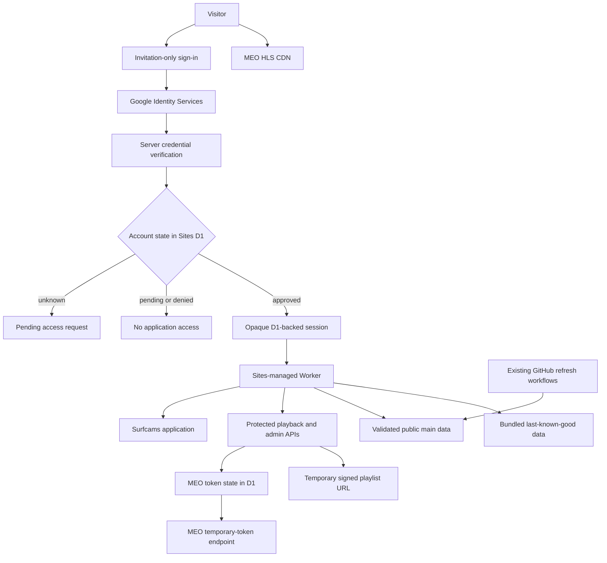

# Sites-Managed Private Surfcams Design

**Date:** 2026-08-22

**Status:** Awaiting written-spec review

**Repository:** `kuangc/surfcams-portugal`

**Target branch:** `codex/meo-only-cameras`

## Summary

Publish Surfcams Portugal through Sites rather than through a user-managed
Cloudflare account. Sites owns the hosting runtime, database, environment
values, versions, and deployment. The user does not need a Cloudflare account.

The live site is invitation-only at the product layer. Visitors use Google to
identify themselves. A previously unknown, Google-authoritative account creates
a pending access request but receives no application access. The owner approves,
denies, revokes, or restores accounts through an owner-only Manage Users page.
Approved users receive opaque, server-managed sessions that can be revoked
immediately.

The accepted provider-native MEO camera catalog and mobile UX remain the product
baseline. Camera playback uses a Sites-hosted server broker for MEO's temporary
token flow. Surfline remains a wave-conditions and spot-intelligence source, but
no Surfline camera HLS feed or still image is shipped or rendered. The existing
GitHub Actions jobs that refresh Surfline conditions and Portugal tides remain
unchanged.

This document supersedes the Cloudflare-account design and plan dated
2026-08-19. Their completed camera-identity, UX, playback-client, and live-probe
work remains useful, but their Cloudflare Access, Durable Object, Wrangler
deployment, and Workers Builds rollout must not be executed.

## Why the Hosting Direction Changed

The previous design incorrectly treated Sites' underlying Cloudflare-compatible
runtime as an account the user had to administer. Existing Sites applications
demonstrate the correct ownership boundary: Sites manages deployment and runtime
resources, while the application may implement its own sign-in gate using
Sites-managed environment values and persistence.

Sites' own private access mode requires a platform sign-in. The user explicitly
does not want ChatGPT sign-in for this site. The app therefore uses a public
Sites deployment with a small application-owned Google sign-in surface. The
application, not the Sites platform login, decides who may enter.

## Goals

- Deploy and operate the site entirely through Sites, with no user-managed
  Cloudflare account.
- Make the sign-in surface say exactly **Invitation only** and describe the site
  as private without referring to family.
- Let any supported Google account attempt sign-in and create one pending access
  request.
- Give the owner a Manage Users page for approval, denial, revocation,
  restoration, and session invalidation.
- Avoid app-owned passwords, password resets, public registration, invitation
  email delivery, and reusable invitation links.
- Restore resilient MEO playback through MEO's current temporary-token flow.
- Retain all accepted camera-identity fixes, responsive behavior, Favorites,
  Explore, Focus, Compare, maps, accessibility, and playback limits.
- Keep only provider-native MEO cameras as camera identities and preserve their
  provider names, locations, coordinates, posters, and streams.
- Keep Surfline conditions, ratings, forecasts, advice, and informational spots
  while excluding Surfline camera media.
- Leave the existing Surfline and tide refresh workflows byte-for-byte
  unchanged.
- Start the new Sites origin with the already approved fresh default Favorites
  and device-local preferences.
- Make the access module understandable and reusable in other Sites projects,
  with isolated users and sessions per project.
- Preserve a staged cutover, complete verification, and rollback path.

## Non-Goals

- ChatGPT, SIWC, or Sites workspace authentication for visitors.
- A shared password or individual app-owned passwords.
- Public self-registration or automatic approval.
- Sending invitation, approval, rejection, or password-reset email.
- Sharing one user database across unrelated Sites projects.
- Proxying MEO manifests, child playlists, or media segments.
- Hiding a temporary signed MEO URL from an already-approved viewer.
- Making public GitHub source or public provider metadata secret.
- Migrating browser-local favorites or settings to server storage.
- Synchronizing preferences between users or devices.
- Reintroducing Surfline HLS feeds or Surfline camera stills.
- Adding a custom domain in the first release.

## Alternatives Considered

### Sites custom external visitors

Sites can manage custom email allowlists and remove individual external
visitors. This is the smallest operational option, but the available platform
contract does not establish a visitor flow that avoids OpenAI or ChatGPT
identity. It does not satisfy the explicit login requirement without a separate
real-user proof, so it is not selected.

### Shared application password

The existing Sites password pattern is simple and proven, but it cannot identify
individual users or revoke only one person. Rotating the password affects
everyone, while existing signed sessions may remain valid. It does not satisfy
the approved management requirements.

### Individual application passwords

Individual passwords would provide per-user revocation but would make this
project responsible for password hashing, resets, temporary credentials,
lockouts, recovery, and secure delivery. That is unnecessary when all intended
visitors can use Google.

### One-use invitation links

A one-use link would allow the first Google account that holds the link to claim
access. It removes email-entry mistakes, but a forwarded or intercepted link is
a bearer credential. The user preferred a Google sign-in attempt followed by
owner approval, which is simpler and easier to audit.

### Selected: Google access requests plus owner approval

Google performs authentication. The application performs authorization. An
unknown account becomes pending, never active. Only an owner can approve it.
This avoids passwords and outbound email while providing individual identity,
approval, and immediate revocation.

## Approved User Experience

### Sign-in page

The public sign-in surface uses this copy:

```text
Invitation only

This is a private site. Sign in with Google to request access.

[ Continue with Google ]
```

Do not use the word “family” on this surface. Do not imply that a Google sign-in
attempt grants access.

### First sign-in attempt

1. The visitor chooses a Google account.
2. The server validates Google's credential and determines whether Google is
   authoritative for the address.
3. An unknown valid account is upserted as one pending request keyed by the
   stable Google subject.
4. No application session is created.
5. The visitor sees: **Request received. Access must be approved by the site
   owner.**

Repeated attempts by the same identity do not create duplicate rows. A denied
identity remains denied and cannot create a new request unless an owner reopens
or approves it.

### Approved sign-in

After approval, the visitor signs in with Google again. The server verifies the
same stable subject, confirms the account is active, creates a session, and
redirects to the app. The site does not request Google API scopes beyond basic
identity and does not retain the Google ID token.

### Pending and denied states

Pending and denied accounts receive distinct plain-language pages. Neither page
contains the application shell, camera data, a signed playback URL, or technical
authentication details.

### Manage Users

The owner-only Manage Users page groups records into:

- Pending
- Approved
- Revoked

Denied requests remain visible in the Revoked group with a distinct `denied`
status so the owner can later approve them without allowing repeated requests.

Each row displays the Google-provided display name when available, the
authoritative email, status, role, request time, and last successful sign-in.
Available actions are:

- Approve
- Deny
- Revoke
- Restore
- Sign out all devices

The first release does not send email. The visitor simply attempts sign-in again
after the owner approves them.

The bootstrap owner cannot revoke their own active owner account. Viewers cannot
access the management page or its APIs. Administrative changes appear in a
compact audit history. The existing Configure surface links to Manage Users and
shows the owner a pending-request count without adding another primary nav item.

### Sign-out

The app includes an ordinary application logout action. Logout deletes the
current session and clears its cookie without signing the user out of Google.

## System Architecture



Sites provides one logical D1 binding named `DB`. It stores authentication
records, sessions, audit events, and the singleton MEO token state. Sites owns
the physical database and deployment wiring.

The site is public at the Sites access-policy layer so unauthenticated visitors
can reach the application-owned sign-in page. The Worker remains the product
access boundary.

## Route Boundary

The standard, lighter access boundary approved during design review is:

### Public

- the sign-in page;
- the Google credential POST endpoint;
- minimal sign-in CSS, JavaScript, icons, and manifest resources;
- other non-secret static CSS, JavaScript, and icon assets;
- a bounded health response;
- logout, which may safely clear an absent or invalid cookie.

### Session-protected

- the main application entry response at `/`, `/index.html`, and any equivalent
  application-shell fallback;
- playback-token and refresh endpoints;
- user-management pages and APIs;
- authenticated same-origin routes that serve the latest Surfline conditions
  and tide data.

General static CSS, JavaScript, icons, and other non-secret assets do not need a
database lookup on every request. They contain no credentials, signed MEO URLs,
user records, or private source data. The repository and provider metadata are
already public. Protecting every byte would add complexity without improving
the approved security boundary.

The public sign-in page uses `noindex, nofollow`, a matching `X-Robots-Tag`, and
invitation-only social metadata without camera imagery or user information.

An already-open page can retain content it has already rendered after
revocation. Its next protected data, administration, or playback request fails,
and a refresh returns to sign-in. This is the normal limitation of revoking a
web session after content has reached a browser.

## Google Authentication

### Client setup

Use Google Identity Services with one Web client ID configured for the final
Sites origin. This requires one Google Cloud project/client setup, but no
Cloudflare account and no Google client secret in the browser or Sites runtime
for the credential-button flow.

Use the explicit Sign in with Google button. Do not enable automatic sign-in or
One Tap in the first release; an intentional click makes the invitation-only
state and account choice clearer.

### Credential validation

Google submits the credential to a same-origin server endpoint. The server:

1. Applies strict content-type, declared-length, streamed-length, and timeout
   bounds.
2. Verifies Google's double-submit `g_csrf_token` cookie and request value.
3. Verifies the ID-token signature using Google's current published keys and
   their cache lifetime.
4. Restricts accepted algorithms to Google's documented `RS256` signing
   algorithm.
5. Validates issuer, audience, expiry, not-before time when present, and
   required claim shapes.
6. Requires `email_verified` to be true and Google to be authoritative for the
   email: an `@gmail.com` account, or a Google Workspace account with a
   hosted-domain claim.
7. Uses the `sub` claim, not email, as the stable identity key.
8. Treats name and email as display/account metadata only.
9. Discards the ID token after the request.

Google's official guidance requires server-side signature, issuer, audience,
and expiry validation, uses `sub` as the stable identifier, and warns that a
verified third-party email without a Gmail suffix or Workspace hosted-domain
claim is not necessarily authoritative. References:

- <https://developers.google.com/identity/gsi/web/guides/get-google-api-clientid>
- <https://developers.google.com/identity/gsi/web/guides/verify-google-id-token>

### Owner bootstrap

Before opening the public sign-in surface, configure one bootstrap owner Gmail
address through Sites runtime configuration. The first valid Google identity
with that authoritative address is atomically bound as the initial owner by
stable Google subject. Once the owner row exists, subject identity controls;
the bootstrap value cannot create a second owner.

## Authentication Data Model

### `auth_users`

- stable internal ID;
- unique Google subject;
- authoritative normalized email;
- optional display name;
- role: `owner` or `viewer`;
- status: `pending`, `active`, `denied`, or `revoked`;
- session generation;
- requested, approved, last-login, revoked, and updated timestamps;
- approving or revoking owner ID when applicable.

### `auth_sessions`

- hash of a cryptographically random opaque token;
- user ID;
- captured session generation;
- created, expires, last-seen, and revoked timestamps.

The raw session token exists only in an `HttpOnly`, `Secure`, `SameSite=Lax`
cookie. D1 stores only its hash. Sessions have a fixed, non-sliding 30-day
lifetime. The server checks that the session is unexpired, unrevoked, matches
the user's current generation, and belongs to an active user.

### `auth_audit_events`

Record bounded events for request creation, approval, denial, revocation,
restoration, and device sign-out. Do not record Google tokens,
session tokens, MEO tokens, signed URLs, or request bodies.

### Indexes and constraints

Use unique indexes for Google subject and normalized email. Index active session
lookup, pending-user ordering, and user audit history based on the actual
queries. Foreign keys and status checks preserve referential and state-machine
integrity. Migrations remain backward-compatible across the initial rollback
window.

## Session and Authorization Behavior

- A successful approved login rotates any login-bound state and creates a new
  opaque session.
- Revocation marks the user revoked, increments their session generation, and
  revokes all current sessions in one logical operation.
- Sign out all devices increments the session generation and revokes sessions
  without changing the user's active status.
- Restore returns a revoked user to active but never restores old sessions.
- Denial remains sticky until an owner explicitly changes it.
- Mutating admin requests require an active owner session, same-origin checks,
  a session-bound CSRF value, strict body limits, and exact request schemas.
- Login/request creation is idempotent per Google subject and rate-limited to
  prevent repeated writes or management-page noise.
- Public responses and authentication errors never reveal whether an email is
  already approved beyond the user's own verified account state.

## Reusable Sites Authentication Module

Keep authentication in a bounded module with four explicit interfaces:

1. `verifyGoogleCredential(request, config)` verifies identity only.
2. `resolveAccessState(db, identity)` creates or reads the account state.
3. `requireSession(request, db)` authenticates an application request.
4. `requireOwner(request, db)` adds owner authorization.

The module owns its D1 schema, session cookie, public login components, Manage
Users components, route middleware, and contract tests. Surf-specific code
depends only on `requireSession` or `requireOwner` and does not read auth tables
directly.

Other Sites projects may copy or later extract this module. Each project gets a
separate D1 binding, bootstrap owner, Google client configuration, users,
sessions, and audit history. Do not build a shared identity service until a real
cross-project requirement exists.

## MEO Playback Broker

### Existing browser contract retained

The browser continues to request:

```text
GET /api/playback/:cameraId
POST /api/playback/:cameraId/refresh
```

Both endpoints require an active session. The server accepts only a canonical
camera ID from the compiled provider-native playable MEO roster and never a
caller-provided upstream URL. Unknown, streamless, promoted, Surfline, or
otherwise unavailable identities return bounded errors.

A successful response contains the canonical camera ID, a temporary signed MEO
master-playlist URL, an opaque revision, and a conservative refresh timestamp.
It uses `private, no-store`. Signed URLs and tokens remain in authorized browser
memory only and never enter logs, HTML, analytics, local storage, or committed
data.

### D1 token coordinator

Sites does not expose the previous plan's Durable Object declaration. Replace it
with one D1 singleton row containing the current token, fetched time, refresh
time, opaque revision, version, and a short acquisition lease.

The coordinator:

1. Returns a complete record only while it is within the 20-hour conservative
   refresh window.
2. Acquires a short lease through a conditional versioned update before
   contacting MEO.
3. Fetches the primary MEO token endpoint and then the documented fallback.
4. Validates and bounds the token response before one conditional overwrite.
5. Preserves the previous complete record if acquisition fails.
6. Lets a concurrent caller reuse a still-fresh record or wait a bounded period
   for the lease holder; it never spins indefinitely.
7. Invalidates by opaque revision and never accepts a caller-provided token or
   upstream URL.

The frontend retains its existing generation-safe, one-refresh-per-player
recovery. Gallery playback receives one 60-second window beginning only after
the first successful play; midstream token recovery does not reset it. Focus,
Compare, and persistent Explore behavior remain as already accepted.

Revocation stops new application and playback requests immediately. An already
issued MEO URL or active HLS session may continue until the provider token
expires. Current observed provider metadata permits up to approximately 24
hours, while the broker refreshes after 20 hours.

## Camera and Surfline Boundaries

- Runtime cameras are the provider-native, playable MEO source records only.
- Each retained camera preserves its own provider ID, name, location,
  coordinates, image, and stream.
- Surfline spot records remain informational identities, not camera identities.
- Explore may display a Surfline informational subject while resolving playback
  and favorite actions to its linked native MEO camera.
- Stretch information uses Surfline names and conditions without Surfline
  camera stills.
- No production asset or runtime source may contain
  `hls.cdn-surfline.com`, Surfline camera-still hosts, raw Surfline override
  registries, or a Surfline playback source.
- Surfline conditions and advice remain available for trusted MEO mappings.

## Scheduled Surfline and Tide Data

Leave the existing GitHub workflows unchanged, including their schedules,
fetch logic, validation, and commit behavior.

Sites versions do not automatically redeploy when those workflows update the
separate public GitHub repository. The authenticated application therefore
loads these volatile datasets through bounded same-origin server routes:

- Surfline conditions from the fixed raw `main` path;
- Portugal tides from the fixed raw `main` path.

Each route:

1. Requires an active application session.
2. Uses an exact repository owner, repository, branch, and file allowlist.
3. Uses redirect, timeout, status, content type, and byte-size bounds.
4. Parses and validates the expected schema and freshness fields before use.
5. Applies a short server cache that never includes user identity.
6. Falls back to the bundled last-known-good file on temporary fetch or
   validation failure.
7. Preserves the app's existing stale-data labeling.

No GitHub token is required because the two source files and repository are
already public. No arbitrary fetch URL is accepted from a browser.

## Error and Recovery Behavior

- Missing authentication configuration or unavailable D1 fails closed with a
  generic temporary-unavailable page or bounded API response.
- Invalid Google credentials, request bodies, or session cookies expose no
  token, claim, account-enumeration, database, or provider detail.
- Pending, denied, revoked, and temporary-unavailable states remain visibly
  distinct.
- A MEO failure affects only the current player or pane.
- A stale or invalid live-data fetch uses the bundled copy and preserves a
  visible freshness indication.
- Unknown routes and methods return bounded 404 or 405 responses rather than
  the application shell.
- All authenticated and sensitive responses use `private, no-store` and
  `X-Content-Type-Options: nosniff`.
- Content Security Policy permits only the reviewed Google Identity Services
  script/frame/connect origins plus the application's existing required
  sources. It does not permit arbitrary scripts or frames.

## Build and Sites Packaging

The current static-assets-plus-Wrangler build is not a deployable Sites package.
Adapt it to the supported Sites Vite path while preserving the vanilla
application rather than rewriting the product UI.

The resulting build must:

- use the Sites Vite integration and Cloudflare-compatible ESM output;
- emit `dist/server/index.js` as the server entry;
- emit only allowlisted non-secret browser assets;
- package `.openai/hosting.json` with logical `d1: "DB"` and `r2: null`;
- include reviewed D1 schema and migration artifacts;
- exclude tests, docs, QA images, local caches, credentials, unreviewed source
  data, and obsolete Cloudflare deployment configuration;
- remain deterministic for one source tree.

Retire production use of Wrangler deployment scripts, Cloudflare Access
configuration, Access JWT validation, Workers Builds instructions, and the
Durable Object binding. Wrangler-compatible tools may remain only where the
Sites build or local tests legitimately require them.

## Validation Strategy

### Authentication unit and integration tests

- Google credential signature, algorithm, issuer, audience, expiry, not-before,
  CSRF, size, timeout, claim-shape, and authoritative-email validation;
- unknown account creates exactly one pending request and no session;
- pending and denied accounts cannot access the app;
- approval enables the next Google sign-in;
- duplicate requests are idempotent and rate-limited;
- active session, expiration, logout, and cookie attributes;
- revocation during an active session;
- restore without session resurrection;
- sign out all devices;
- viewer denial at owner routes;
- bootstrap-owner self-revocation safeguards;
- admin CSRF, same-origin, body-limit, and exact-schema enforcement;
- missing configuration and D1 failure are fail-closed;
- no credential, ID token, session token, MEO token, or signed URL appears in
  public errors or logs.

### Route-boundary tests

- anonymous sign-in assets remain reachable;
- anonymous main-app navigation returns sign-in;
- anonymous playback and admin APIs are denied;
- public static assets contain no secret or signed media material;
- approved sessions reach the app and playback API;
- revoked sessions fail on the next protected request;
- unknown paths and methods remain bounded.

### Playback and data tests

- the existing playback client, player-generation, 60-second lifecycle, Focus,
  Compare, Explore, Favorites, and mobile suites remain green;
- D1 token lease, concurrent acquisition, refresh, failure preservation, opaque
  revision, and bounded wait behavior;
- no direct unsigned playback path in production players;
- exact fixed GitHub data origins, schema/size/time bounds, cache behavior, and
  bundled fallback;
- no Surfline camera media in source or deployable assets;
- provider-native camera identity invariants;
- deterministic Sites package contents.

### Live acceptance

Before cutover:

1. Run the complete local suite, advice/data checks, deterministic package
   build, and freshness gate.
2. Run the redacted signed-MEO acceptance probe against the complete roster,
   using the already approved systemic-vs-camera-local policy and both
   representative HLS chains.
3. Deploy owner-only through Sites.
4. Confirm the final origin is registered with the Google Web client.
5. Confirm owner login and Manage Users behavior.
6. Use a second Google account to request access, approve it, sign in, revoke it
   while active, and confirm its next protected request fails.
7. Confirm direct anonymous access to the app, playback API, and admin API is
   denied while the login surface remains available.
8. Exercise the complete app on desktop and a physical iPhone Safari/A2HS
   installation, including playback, Favorites, Focus, Compare, Explore, maps,
   refresh recovery, and logout.
9. Confirm Surfline conditions and tide data reflect the latest GitHub refresh
   or the explicitly labeled bundled fallback.

## Deployment and Cutover

1. Rework and reaccept a new source candidate. The previous accepted commit,
   tree, and manifest identify the abandoned Cloudflare-account architecture
   and are not deployable release evidence after these changes.
2. Confirm there is no existing Sites project for this surf app before creating
   one. Persist the returned project ID only in `.openai/hosting.json`.
3. Build, save, and deploy the candidate with Sites owner-only access first.
4. Configure the final Sites origin and consent branding in one Google Web
   client. The user completes any Google account/consent-screen action that
   requires their identity; no client secret is required for the selected
   credential flow.
5. Configure the Google client ID and bootstrap owner email through Sites
   runtime values, redeploy the same saved candidate as required, and complete
   owner-only testing.
6. Prove the application gate before changing Sites-level access.
7. With explicit user approval, set the Sites deployment to public. The public
   origin continues to expose only **Invitation only** to an unapproved visitor.
8. Complete the second-account approval/revocation and device acceptance.
9. Push the exact accepted source to GitHub and the Sites source repository.
10. Leave GitHub Pages live until the Sites production smoke test and rollback
    drill pass, then disable Pages and verify the old URL no longer serves the
    app.

## Rollback

Sites saved versions are the rollback unit. Record the accepted and production
version IDs. Drill rollback to the accepted prior functional Sites version,
smoke test it, and restore the production version.

D1 persists across code rollbacks. Initial migrations must therefore be
additive and compatible with both the accepted candidate and its immediate
rollback target. Do not delete or destructively rewrite auth or token-state
tables during the first release.

GitHub Pages can be re-enabled only as an explicit emergency action. Doing so
would intentionally restore public access and unsigned playback limitations.

## Operational Management

Normal access management happens in the site's Manage Users page:

- review pending Google requests;
- approve or deny;
- revoke or restore;
- sign out all devices;
- inspect bounded audit history.

Sites management is used for runtime configuration, versions, D1 ownership,
and deployment—not day-to-day user approval. Google Cloud management is used
only for the Web client and consent branding. No Cloudflare account is part of
normal setup or operations.

For reuse in another Sites project, copy the reviewed auth module and migration,
configure that project's own Google client/origin and bootstrap owner, and run
the same security acceptance. Do not point multiple projects at one auth
database by default.

## Residual Risks and Accepted Limits

- An already-issued MEO signed URL may remain usable after account revocation
  until the provider token expires, currently observed at up to approximately
  24 hours.
- Already-rendered page content cannot be removed from a revoked browser, but
  its next protected request and refresh fail.
- Public GitHub source and provider metadata remain public; the access boundary
  protects the hosted experience and signed playback capability, not public
  source-code secrecy.
- Google authentication depends on Google Identity Services availability and
  one correctly configured Web client.
- Unknown verified Google accounts can create pending requests. Deduplication,
  rate limiting, sticky denial, and owner approval prevent those requests from
  becoming access.
- Sites and D1 are managed services. A platform outage fails closed and may make
  the private site temporarily unavailable.

## Definition of Done

- The site is deployed through Sites; the user has not needed a Cloudflare
  account.
- Anonymous visitors see **Invitation only** and no surf application.
- An unknown supported Google account produces one pending request and no
  session.
- The owner can approve, deny, revoke, restore, and sign out all devices.
- Revocation blocks the next protected request from an active browser.
- The new Sites origin starts with the approved fresh default Favorites and
  device-local preferences.
- All existing product features and accepted mobile fixes remain.
- Runtime camera identities are provider-native MEO only.
- Surfline wave information remains while Surfline camera media is absent.
- The unchanged Surfline and tide workflows continue feeding validated current
  data without requiring a Sites redeployment.
- MEO signed playback passes the redacted release probe and live desktop/iPhone
  acceptance within the approved provider-availability policy.
- The complete automated suite, data/advice checks, package validation, and
  source-safety scans pass.
- The Sites rollback drill succeeds.
- GitHub Pages is retired only after the Sites production release is accepted.
- The auth module and setup runbook are reusable by another Sites project
  without sharing its users or sessions.
